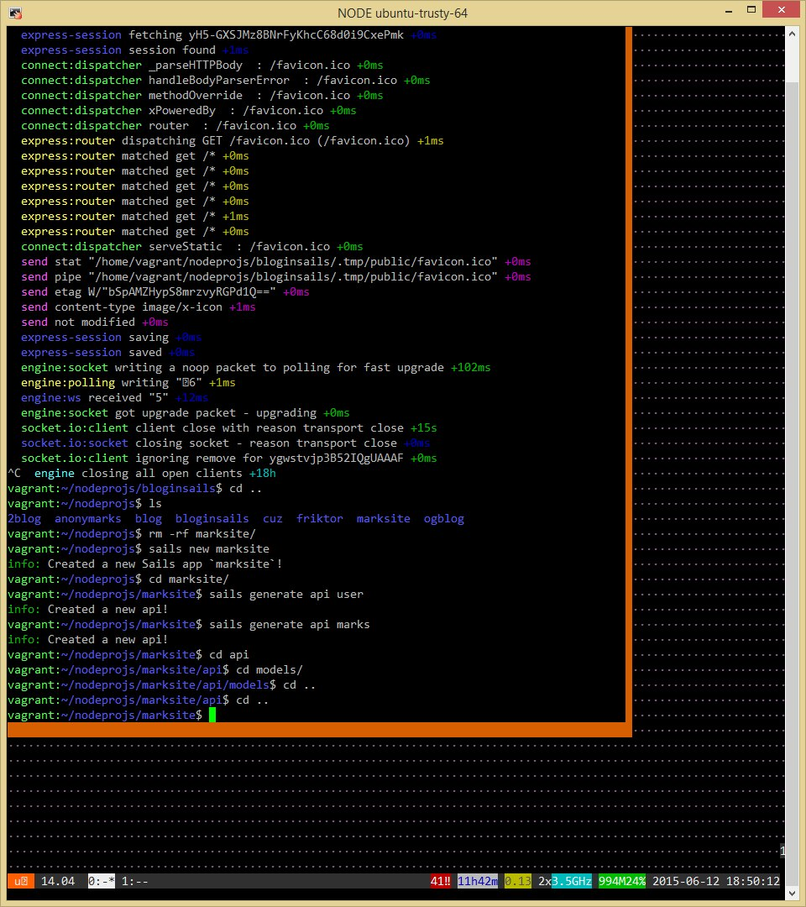
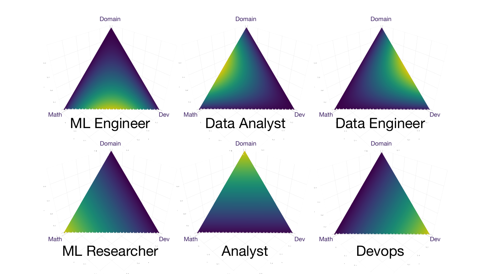
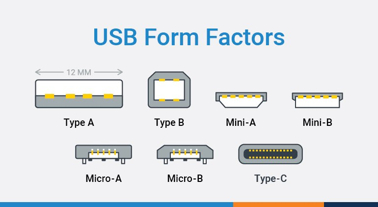
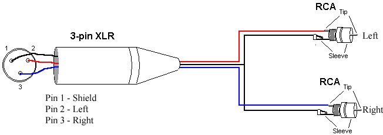

# pavtiger's knowledge
It is highly welcome to point out mistakes and improvements in issues.

## Table of Contents
1. [LINUX](#linux)
2. [VIM](#vim)
3. [GIT](#git)
4. [SSH](#ssh)
5. [APT](#apt)
6. [BYOBU / TMUX](#byobu)
7. [PYTHON](#python)
8. [ML/DL](#ml-dl)
9. [DWM](#dwm)
10. [UBUNTU](#ubuntu)
11. [RASPBERRY](#raspberry)
12. [HARDWARE, MOTHERBOARDS, BIOS, DATA](#harware)
13. [DOCKER](#docker)
14. [SERVERS, STORAGE](#servers)
15. [WINDOWS](#windows)
16. [VIRTUALISATION](#virt)
17. [LABEL-STUDIO](#label-studio)
18. [OTHER](#other)
19. [RULES](#rules)


## LINUX <a name="linux"></a>
Opening and editing markdown files:
```shell
apostrophe main.md
```

iptables list all
```shell
sudo iptables -A
```

Get assigned ip on a specific interface (here: **wlan0**)
```shell
ip -f inet addr show wlan0 | awk '/inet / {print $2}'
```
And get all ips on machine
```shell
/sbin/ifconfig | grep -Eo 'inet (addr:)?([0-9]*\.){3}[0-9]*' | grep -Eo '([0-9]*\.){3}[0-9]*' | grep -v '127.0.0.1'
```

Find location
```shell
ldd gpg
```

Setup network bridge
```shell
nmcli connection add type bridge ifname br0 stp no

nmcli connection add type bridge-slave ifname enp7s0 master br0

nmcli connection down enp7s0

nmcli connection up bridge-br0
nmcli connection up bridge-slave-enp7s0
```

Monitor all files accessed by a command
```shell
strace -f -o log -e openat,open,creat ./command
```

Monitor file changes (cat and update)
```shell
watch cat /proc/mdstat
```

Unmount a busy device
```shell
umount -l /PATH/OF/BUSY-DEVICE
```

Mount all records from `/etc/fstab`
```shell
mount -a
```

Create image of a disk
```shell
# zero out all empty bytes on target storage device
dd if=/dev/zero of=/run/media/pavtiger/rootfs/asdf.txt
# then delete file
# create image and compress it
sudo dd if=/dev/sda bs=1M status=progress | gzip -c > image.gz
```

Run darktable when it does not start
```shell
darktable --disable-opencl
```

Upgrade Yark
```shell
python -m pip install yark --upgrade
```

Motioneye
```shell
# Start in a docker container
docker pull ccrisan/motioneye:master-armhf
docker run --name="motioneye" \
    -p 8765:8765 \
    --hostname="motioneye" \
    -v /etc/localtime:/etc/localtime:ro \
    -v /etc/motioneye:/etc/motioneye \
    -v /var/lib/motioneye:/var/lib/motioneye \
    --restart="always" \
    --detach=true \
    ccrisan/motioneye:master-armhf
```

Fix blueman not recognising Logitech MX Master 3 ([discussion](https://github.com/blueman-project/blueman/issues/817)))
```shell
sudo pacman -R blueman bluez bluez-utils pulseaudio-bluetooth bluez-qt
systemctl restart bluetooth
```

Managing disk with nice GUI - `gparted`

[Fix no ethernet nmtui or in machine itself](https://askubuntu.com/questions/904545/networkmanager-doesnt-show-ethernet-connection)

Port numbers in computer networking represent communication endpoints. Ports are unsigned 16-bit integers (0-65535) that identify a specific process, or network service. IANA is responsible for internet protocol resources, including the registration of commonly used port numbers for well-known internet services.
Well Known Ports: 0 through 1023.
Registered Ports: 1024 through 49151.
Dynamic/Private : 49152 through 65535.


## VIM <a name="vim"></a>
* `:w !sudo tee %` - save file with sudo permissions
* `:%s/foo/bar/gc` - search and replace
* `[line] + G` - jump to line
* `ctrl + o`, `ctrl + l` - unjump (back) and ununjump
* `W, shift w, b, e` - move in words
* `0` - jump to first symbol in line
* `$` - jump to last symbol in line
* `gg` - jump to file start
* `G` - jump to file end
* `: !<shell command>`
* `/word` - search in file
* `:set mouse-=a` - fix cursor select
* `:%s/\s\+$//` - remove redundant spaces from line ends
* `:s/\<bar\>/baz` - replace full words (`\<bar\>`). [stack overflow](https://stackoverflow.com/questions/15288155/how-to-do-whole-word-search-similar-to-grep-w-in-vim)
* `:retab` - update tabs in document

My minimal .vimrc
```shell
set softtabstop=0 expandtab
set tabstop=4
set shiftwidth=4
set number
```


## GIT <a name="git"></a>
Fit fix permissions (empty git diff for some files)
```shell
git config core.fileMode false
```

Apply patch
```shell
patch -p1 < path/file.patch
```

Git pull (fetch) another branch
```shell
git fetch origin branch:branch
```

Delete branch
```shell
git branch --delete <branchname>
```

Pull git submodules
```shell
git submodule update --init --recursive
```
or just when cloning
```shell
git clone repo.git --recursive
```

Git reset a single file to it's remote state
```shell
git checkout HEAD -- my-file.txt
```


## SSH <a name="ssh"></a>
sshfs mount
```shell
sshfs -o follow_symlinks andrey:/home/andrey/railings-automatic-collection ~/Docs/andrey
```


## APT <a name="apt"></a>
apt sources file (remotes)
```shell
/etc/apt/sources.list
```


## BYOBU / TMUX <a name="byobu"></a>
Byobu turn off tabs auto renaming
`set-option -g allow-rename off` in file `/usr/share/byobu/profiles/tmux`

```shell
byobu list-session
```

Fix byobu not resizing window propperly

```shell
Alt + F6
```

Byobu kill window
```shell
Ctrl + F6
```

Re-color status bar
```shell
Control + Shift + F5
```


## PYTHON <a name="python"></a>
Install pip on any version of python
```shell
curl -sS https://bootstrap.pypa.io/get-pip.py | python3.10
```


## ML/DL <a name="ml-dl"></a>
Triangle of ML jobs  



## DWM <a name="dwm"></a>
dwm get active monitor ([link](https://www.reddit.com/r/suckless/comments/k7806r/querying_active_monitor_in_dwm/), [link](https://dwm.suckless.org/patches/ipc/))
Take 4k screenshots with 1080 monitor (rescale xrandr output)
```shell
xrandr --output eDP --scale 2x2 --panning 3840x2160
```


## UBUNTU <a name="ubuntu"></a>
Ubuntu do not go to sleep on lid close
file `vim /etc/systemd/logind.conf`, uncomment and change `HandleLidSwitch=ignore`

Ubuntu get current release version (for example 22.04)
```shell
lsb_release -a
```


## RASPBERRY <a name="raspberry"></a>
Network configuration from a file. Connect micro SD card to your computer and mount `boot` partition. Then create file `wpa_supplicant.conf` using this template (this file will then be in `/etc/wpa_supplicant/wpa_supplicant.conf`)
```text
ctrl_interface=DIR=/var/run/wpa_supplicant GROUP=netdev
update_config=1
country=RU

network={
        ssid="name"
        psk="password"
}
```
On next boot up raspberry will automatically connect to the network. You can also turn on **System Options** >> **Network at Boot** in `sudo raspi-config`. That way your OS starts only when network has been connected (fixes possible issues in scripts)

[Raspberry temperature and humidity sensor script](https://www.freva.com/dht11-temperature-and-humidity-sensor-on-raspberry-pi/)

## HARDWARE, MOTHERBOARDS, BIOS, DATA <a name="hardware"></a>
[Install drivers nvidia on ubuntu](https://askubuntu.com/questions/1112814/install-driver-for-gtx-1070)

asus change integrated gpu setting (igpu)  
`BIOS -> advanced -> System agent -> graphics configuration -> Primary display`

USB standards:


`testdisk` - Recover disk (NO GPT support)
`photorec` - better alternative with wider support

XLR splitter diagram  



## DOCKER <a name="docker"></a>
Docker create user and run without sudo
```shell
sudo groupadd docker
sudo gpasswd -a $USER docker
newgrp docker
```

[Docker migrate image](https://stackoverflow.com/questions/23935141/how-to-copy-docker-images-from-one-host-to-another-without-using-a-repository)

Docker create GUI display  
https://leimao.github.io/blog/Docker-Container-GUI-Display/

Dockerfile example
```shell
FROM ubuntu:22.04
RUN apt update && apt install -y jq vim git curl && rm -rf /var/lib/apt/
RUN cd /usr/local && git clone https://github.com/kolayne/clone_all_repos.git && cd clone_all_repos
COPY backup_github.sh /usr/local/clone_all_repos/
ENTRYPOINT /usr/local/clone_all_repos/backup_github.sh
```

Docker workflow example
```shell
docker build -t medsenger .
docker run -dti --name medsenger medsenger
docker exec -it medsenger bash
docker stop medsenger
docker rm medsenger
```

Docker remove auto-start on container
```shell
docker update --restart=no container-name
```

## SERVERS, STORAGE <a name="servers"></a>
[create GPT RAID6](https://unix.stackexchange.com/questions/318098/mdadm-raid-implementation-with-gpt-partitioning)

linux test write speed
```shell
dd if=/dev/zero of=/tmp/test1.img bs=1G count=1 oflag=dsync
```

linux run speedtest in a docker container
```shell
docker run --rm -it gists/speedtest-cli
```

Create X virtual framebuffer (Xvfb) for GUI applications on headless server (but cannot use GPU propperly)
```shell
Xvfb :1 &  # Create X virtual framebuffer
PID=$!
DISPLAY=:1 python3 client.py
kill $PID
```

[Server naming conventions](https://namingschemes.com/)  
[My selected naming convention](https://namingschemes.com/Star_Wars)


## WINDOWS <a name="windows"></a>
Running an `.exe` file using an absolute path with spaces
```shell
& "C:\Program Files\Blender Foundation\Blender 3.4\blender.exe" -b project.blend -E BLENDER_EEVEE --python use_gpu.py -o C:\Users\pavti\Documents\process-client\render\### -s 1 -a
```


## VIRTUALISATION <a name="virt"></a>
Windows virtual machine setup

BIOS
```shell
FX0:

lspci -nnk
```

Edit grub
```shell
vim /etc/default/grub
```
With
```shell
GRUB_CMDLINE_LINUX_DEFAULT="quiet splash intel_iommu=on kvm.ignore_msrs=1 vfio-pci.ids=10de:2206,10de:1aef,10de:1b81,10de:10f0,8086:1901,8086:1905"
```
Reboot grub
```shell
grub-mkconfig -o /boot/grub/grub.cfg
```

`vim /etc/modprobe.d/vfio.conf`
```shell
blacklist nvidia
blacklist snd_hda_intel
options vfio-pci ids=10de:2206,10de:1aef
```

Host machine
Turn off power management and screen saver

Remove gdm
```shell
sudo dpkg-reconfigure gdm3
```

The normal Mint display manager is MDM, which with a bit of luck you can restore as the default with...
```shell
sudo apt-get install --reinstall mdm
```

Remote desktop

Client for arch
```shell
yay realvnc-vnc-viewer
```

[Server](https://community.linuxmint.com/tutorial/view/2334)

```shell
sudo apt-get -y install x11vnc
sudo mkdir /etc/x11vnc
sudo x11vnc --storepasswd /etc/x11vnc/vncpwd
sudo vim /lib/systemd/system/x11vnc.service
```

```
[Unit]
Description=Start x11vnc at startup.
After=multi-user.target

[Service]
Type=simple
ExecStart=/usr/bin/x11vnc -auth guess -forever -noxdamage -repeat -rfbauth /etc/x11vnc/vncpwd -rfbport 5900 -shared

[Install]
WantedBy=multi-user.target

sudo systemctl daemon-reload
sudo systemctl enable x11vnc.service
sudo systemctl start x11vnc.service
```

Connect
```shell
vncviewer 192.168.1.150
```

Running windows in virtual machine

```shell
sudo systemctl enable libvirtd --now
sudo adduser pavtiger libvirt
```


## LABEL-STUDIO <a name="label-studio"></a>
Fix label-studio attempt to write a readonly database  
https://github.com/heartexlabs/label-studio/issues/3505
```shell
sudo chown -R 1001:root mydata
docker run -it -p 1331:8080 --user root --name label-studio --env-file ./env -v `pwd`/mydata:/label-studio/data heartexlabs/label-studio:latest
```


## OTHER <a name="other"></a>
FTL save path `~/.local/share/FasterThanLight`

[Mixxx](https://mixxx.org/) - DJ Software for Linux

Best climbing shoes brands
`Scarpa` - Italian brand
`La sportina` - Italian brand, has some very high end climbing shoes
`5.10` - American brand, wider shoes

Edit video losslesly - [LosslessCut](https://github.com/mifi/lossless-cut)


## RULES <a name="rules"></a>
1) Between points there should be two empty lines for readability
2) Between two different instructions there should be one empty line
3) Each point starts with ## (second level of header)
